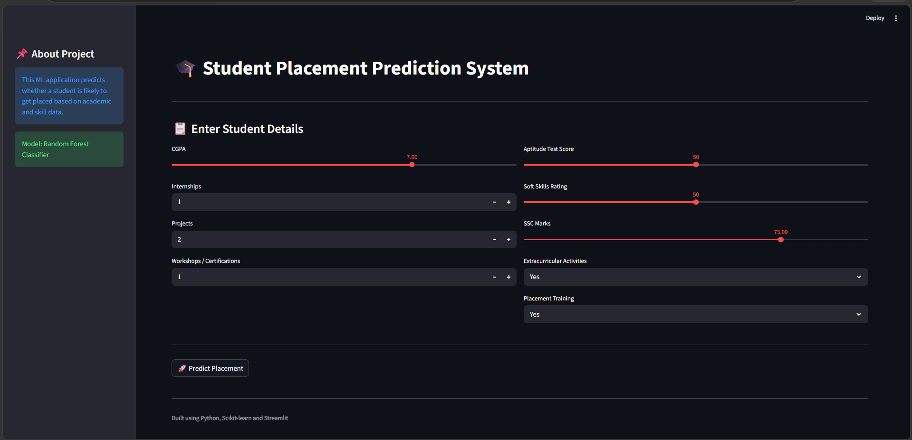
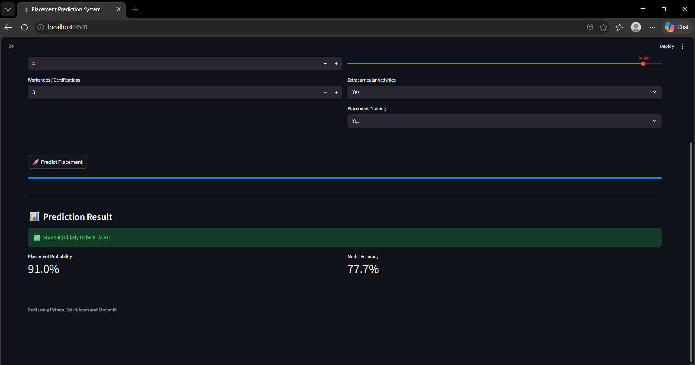

# 🎓 Student Placement Prediction System

## 📌 Project Overview

This project predicts whether a student is likely to get placed based on academic performance, skills, internships, projects, and extracurricular activities using Machine Learning.

The application is built using Python, Scikit-learn, and Streamlit.

---

## 🚀 Features

- Predicts student placement status
- Interactive Streamlit web application
- Machine Learning classification model
- Feature importance analysis
- Clean and user-friendly UI

---

## 🛠 Technologies Used

- Python
- Pandas
- NumPy
- Scikit-learn
- Streamlit
- Joblib

---

## 🤖 Machine Learning Algorithm

- Random Forest Classifier

---

## 📊 Dataset Features

- CGPA
- Internships
- Projects
- Workshops/Certifications
- Aptitude Test Score
- Soft Skills Rating
- SSC Marks
- Extracurricular Activities
- Placement Training

---

## 📈 Model Evaluation

- Accuracy Score
- Confusion Matrix
- Classification Report
- Feature Importance

---

## 🖥 Streamlit Interface

### Home Page



### Prediction Result



---

## ▶️ How To Run Project

### Install Libraries

```bash
pip install -r requirements.txt
```

### Run Streamlit App

```bash
streamlit run app.py
```

---

## 📌 Future Improvements

- Better UI/UX
- More ML model comparisons
- Online deployment
- Visualization dashboard

---

## 👨‍💻 Author

Developed by Charu Haasini
